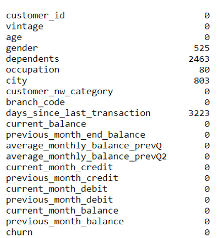
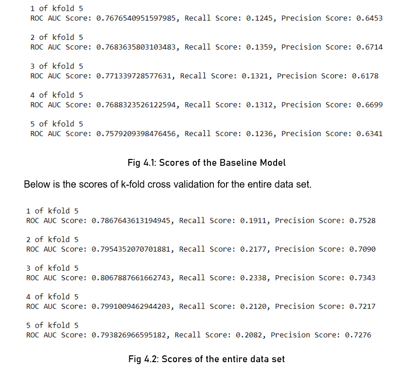
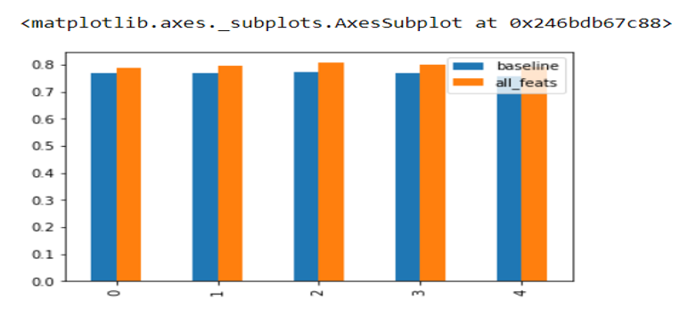

# Customer-Retention-Predictor

A predictive model which predicts if a customer's bank balance will go below the bank's minimum balance based on his financial and personal status. This model is implented using the python language. The data-set used to train this model, has the following columns/features.

Column Name (Feature)  -	Description

1.customer_id 	       - Customer ID

2.vintage	             - Vintage of the customer with the bank in number of days

3.age                  -	Age of customer

4.gender               -	Gender of customer

5.dependents	         - Number of dependents

6.occupation	         - Occupation of the customer

7.city                 -	City of customer

8.customer_nw_category - Net worth of customer (3:Low 2:Medium 1:High)

9.branch_code	         - Branch Code for customer account

10.days_since_last_transaction -	No of Days Since Last Credit in Last 1 year

11.current_balance	   - Balance as of today

12.previous_month_end_balance	 - End of Month Balance of previous month

13.average_monthly_balance_prevQ	- Average monthly balances (AMB) in Previous Quarter

14.average_monthly_balance_prevQ2	 - Average monthly balances (AMB) in previous to previous quarter

15.current_month_credit - Total Credit Amount current month

16.previous_month_credit -Total Credit Amount previous month

17.current_month_debit	 - Total Debit Amount current month

18.previous_month_debit	- Total Debit Amount previous month	

19.current_month_balance - Average Balance of current month

20.previous_month_balance - Average Balance of previous month

21.churn - Average balance of customer falls below minimum balance in the next quarter (1/0) 1-Yes. 0-No.

I split the original data set into a training data set and a testing data set.
I trained the model using the training set, and I tested the model using the testing data set.

Packages Used

1.Numpy: Has advanced mathematical functions 

2.Pandas: package dealing with creation and manipulation of data sets using 

data frames.

3.Matplotlib: for plotting various graphs.

4.Sklearn: To build the logistic regression model, uses various evaluation	 
metrics like Precision, Recall and k Fold Cross Validation.

There were missing values.

These missing values were then treated and effectively removed using the dataframe.dropna() function. Missing values are dealt by using .dropna() function. 
For the column ‘days_since_last_transaction’ A fair assumption can be made 
on this column as this is number of days since last transaction in 1 year, we 
can substitute missing values with a value greater than 1 year say 999

Logistic regression works best on data that has been a uniform scale, so we 
scale the data within a particular range for an efficient model. 
For column ‘dependents’ replace missing values with ‘0’ and for ‘occupation’ column fill 
the values with  ‘self_employed’.

Our data set is broken into three parts, one part is the training set to train our 
model , the other part is the testing set to test the model, and finally the 
validation test to get an estimate of how well our model performs with unkown 
data.

So we try to create two data sets, one which has all the columns(dataset 2)and another 
one with only the columns with high impact on the target variable(dataset 1). Take each of the data sets, and split them into training set and testing set. Then create 
the logistic regression model by using sklean.LogisticRegression package. To the logistic regression object pass the training data. Then use the testing data to evaluate 
its performance. 

Lets call the dataset 1 as the baseline data set. Split the baseline data set into training and testing data. Pass them to the logistic regression model. 

To evaluate the model effectively I used, Cross Validation. Cross Validation is one of the most important concepts in any type of data modelling. It simply says, try to leave a sample on which you do not train the model and test the model on this sample before finalizing the model. We divide the entire population into k equal samples. Now we train models on k-1 samples and validate on 1 sample. Then, at the second iteration we train the model with a different sample held as validation.

In k iterations, we have basically built model on each sample and held each of them as validation. This is a way to reduce the selection bias and reduce the variance in prediction power. Since it builds several models on different subsets of the dataset, we can be more 
sure of our model performance if we use CV for testing our models. 

Soo as the scores after performing k-fold cross validation for the base line data set
Are shown below.

Bar graph of the scores.

